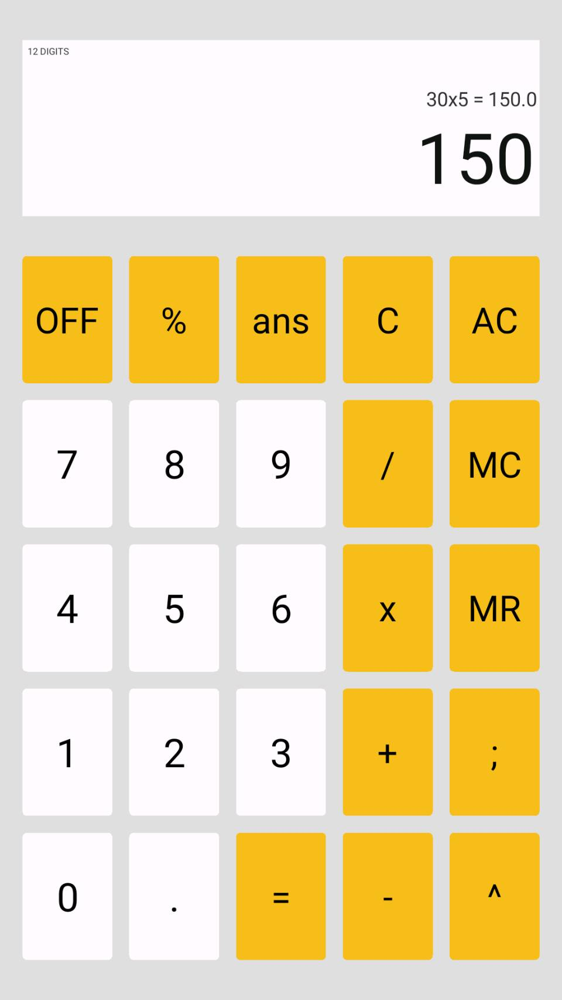
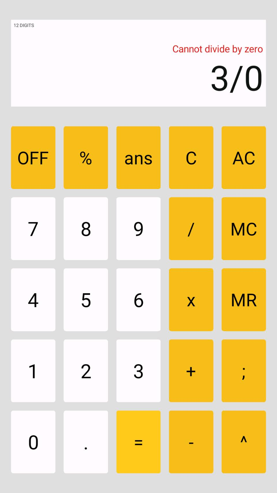

# Tubes_OOP_Calculator
This project is used to make calculator with GUI using Object-Oriented Programming. Our calculator can run on multiple platform such as Windows, Linux, and Android.

This program is made using Java 1.8 with Processing library.

## Screenshots
 

## Code Structure
```
├───app
│       Main.pde
│       TextBox.pde
│       View.pde
│
├───button
│   │   Button.pde
│   │   ButtonBuilder.pde
│   │   FunctionButton.pde
│   │   NonFunctionButton.pde
│   │   NumberButton.pde
│   │
│   └───function
│           AC.pde
│           C.pde
│           Equal.pde
│           Function.pde
│           MC.pde
│           MR.pde
│           OFF.pde
│
├───exception
│       ArithmeticException.pde
│       ConversionException.pde
│       Exception.pde
│       MemoryException.pde
│       OverflowException.pde
│       SquareRootOfNegativeException.pde
│       ZeroDivisionException.pde
│
└───expression
        AddExpression.pde
        BinaryExpression.pde
        DivideExpression.pde
        Expression.pde
        ExpressionBuilder.pde
        ModuloExpression.pde
        MultiplyExpression.pde
        NegativeExpression.pde
        PowerExpression.pde
        RootExpression.pde
        SubtractExpression.pde
        TerminalExpression.pde
        UnaryExpression.pde
```

## Compile and Run
1. Open `Main.pde` using Processing 3.x
1. Press `CTRL + R` to Compile and Run the program

## Created by
This program is created by:
- [Jovan Karuna Cahyadi](https://github.com/JovanKaruna)    / 13518024
- [Byan Sakura Kireyna Aji](https://github.com/prtmery) / 13518066
- [Daniel Riyanto](https://github.com/Daniel-Ri)          / 13518075
- [Jonathan Yudi Gunawan](https://github.com/JonathanGun)   / 13518084

## Knowledgment
This project is used to fulfill our assignment given by IF2210 subject as foundation for us in order to have a better understanding for Object Oriented Programming. 
